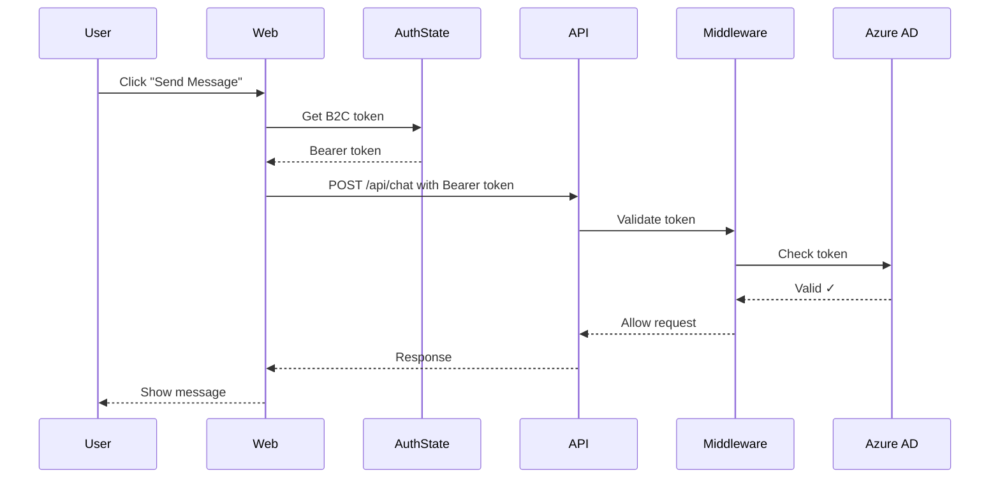
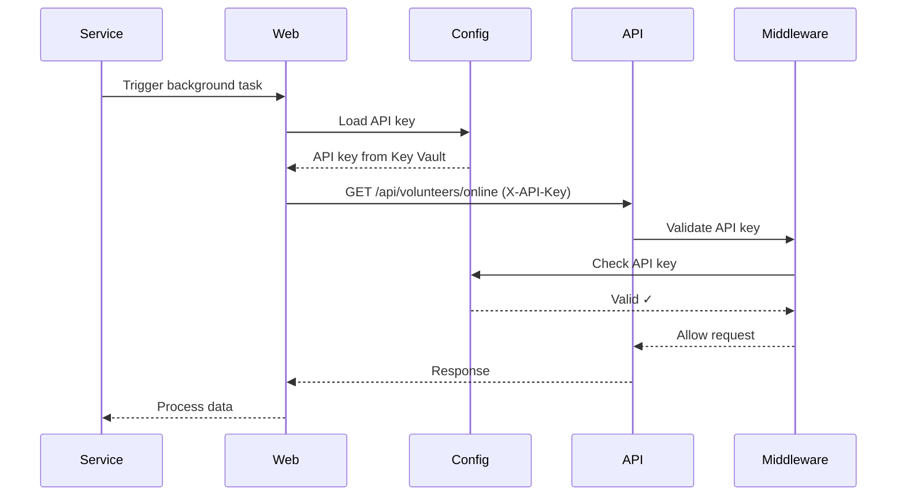

# Quick Start Guide - API Client Setup

## What Was Implemented

AidCircle now has **complete API client architecture** with dual authentication:
- ✅ REST API backend with CORS and authentication middleware
- ✅ Web frontend API client with Azure AD B2C + API key support
- ✅ All secrets managed via Azure Key Vault
- ✅ Hybrid service for seamless migration

---

## Quick Setup (5 Minutes)

### Step 1: Generate API Key

```powershell
# Generate secure 32-character API key
$apiKey = -join ((48..57) + (65..90) + (97..122) | Get-Random -Count 32 | ForEach-Object {[char]$_})
Write-Host "Generated API Key: $apiKey" -ForegroundColor Green

# Store in Azure Key Vault
az keyvault secret set \
  --vault-name aidcirclekeyvault \
  --name "ApiSettings--ApiKey" \
  --value $apiKey

# Save this key somewhere safe for local development!
```

### Step 2: Update Local Configuration

Create `H4H.Presentation.Web/H4H.Presentation.Web/appsettings.Development.Local.json`:

```json
{
  "ApiSettings": {
    "ApiKey": "YOUR_GENERATED_API_KEY_FROM_STEP_1",
    "BaseUrl": "https://localhost:5135"
  }
}
```

Create `H4H.Presentation.API/appsettings.Development.Local.json`:

```json
{
  "ApiSettings": {
    "ApiKey": "YOUR_GENERATED_API_KEY_FROM_STEP_1"
  }
}
```

### Step 3: Run Both Applications

```powershell
# Terminal 1 - API (run first)
cd H4H.Presentation.API
dotnet run

# Terminal 2 - Web
cd H4H.Presentation.Web/H4H.Presentation.Web
dotnet run
```

### Step 4: Test

1. Navigate to `https://localhost:5011` in browser
2. Sign in with Azure AD B2C
3. Go to `/chat` and send a message
4. Check API terminal for authentication logs:
   - "Request authenticated via Azure AD B2C bearer token" ✅

---

## How It Works

### User Operations (Chat, Orders, Items)



### Service Operations (Background Tasks)



---

## Configuration Summary

### Local Development

| File | Setting | Value |
|------|---------|-------|
| Web `appsettings.json` | `ApiSettings:BaseUrl` | `https://localhost:5135` |
| Web `appsettings.Development.Local.json` | `ApiSettings:ApiKey` | Your generated key |
| API `appsettings.Development.Local.json` | `ApiSettings:ApiKey` | Same key as Web |

### Production (Azure App Service)

| Resource | Setting | Source |
|----------|---------|--------|
| Web App | `ApiSettings:BaseUrl` | Environment variable: `https://api.aidcircle.net` |
| Web App | `ApiSettings:ApiKey` | Key Vault: `ApiSettings--ApiKey` |
| API App | `ApiSettings:ApiKey` | Key Vault: `ApiSettings--ApiKey` |
| API App | `ApiSettings:AllowedOrigins` | Environment variable: `https://aidcircle.net` |

---

## Verify Setup

### Test 1: API Health Check

```powershell
Invoke-RestMethod -Uri "https://localhost:5135/health"

# Expected:
# {
#   "Status": "Healthy",
#   "Timestamp": "2025-11-09T..."
# }
```

### Test 2: API Key Authentication

```powershell
$apiKey = "YOUR_API_KEY_HERE"

Invoke-RestMethod -Uri "https://localhost:5135/api/volunteers/online" `
  -Headers @{"X-API-Key" = $apiKey}

# Should return volunteers or empty array
```

### Test 3: Web App Connectivity

1. Run both API and Web
2. Navigate to `https://localhost:5011/chat`
3. Send a message
4. Check API terminal for: "Request authenticated via Azure AD B2C bearer token"

---

## Troubleshooting

### "Unauthorized: Missing authentication credentials"

**Fix**: Check API key in `appsettings.Development.Local.json`:
```json
{
  "ApiSettings": {
    "ApiKey": "YOUR_API_KEY"
  }
}
```

### "CORS error" in browser console

**Fix**: Verify API `appsettings.json` has correct origins:
```json
{
  "ApiSettings": {
    "AllowedOrigins": "https://localhost:5011,http://localhost:5011"
  }
}
```

### "Cannot connect to API"

**Fix**: 
1. Ensure API is running first
2. Check `ApiSettings:BaseUrl` in Web appsettings
3. Verify firewall isn't blocking localhost:5135

---

## Next Steps

### Local Development ✅
- [x] API key generated and stored in Key Vault
- [x] Local configuration files created
- [x] Both apps running successfully
- [x] Authentication working

### Production Deployment ⏳
1. Deploy API to Azure App Service
2. Configure custom domain `api.aidcircle.net`
3. Add SSL certificate (free managed cert)
4. Update Web app `ApiSettings:BaseUrl`
5. Test end-to-end authentication

### Future Enhancements 💡
- API versioning (`/api/v1/...`)
- Response caching
- Rate limiting
- API metrics and monitoring
- Swagger documentation

---

## Documentation

- **[Complete Implementation Details](API-CLIENT-IMPLEMENTATION.md)** - Full technical summary
- **[API Authentication Guide](docs/api-authentication-secrets.md)** - 600+ line comprehensive guide
- **[Architecture Overview](docs/architecture-overview.md)** - System design
- **[Deployment Guide](docs/deployment.md)** - Azure deployment

---

## Success! 🎉

You now have:
- ✅ Production-ready API client architecture
- ✅ Dual authentication (B2C + API key)
- ✅ All secrets in Key Vault
- ✅ Complete documentation
- ✅ Zero hardcoded credentials
- ✅ Scalable multi-tier architecture

**Total Files Changed**: 12 files, 1,871 insertions
**Build Status**: ✅ Succeeded with 0 errors
**Git Status**: ✅ Committed and pushed to `v1-deployment`
