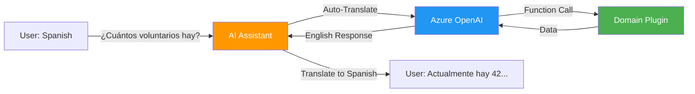
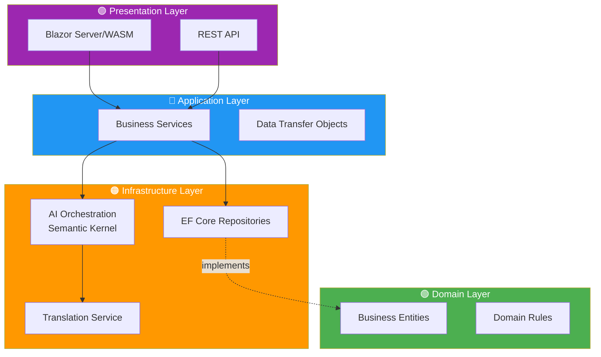
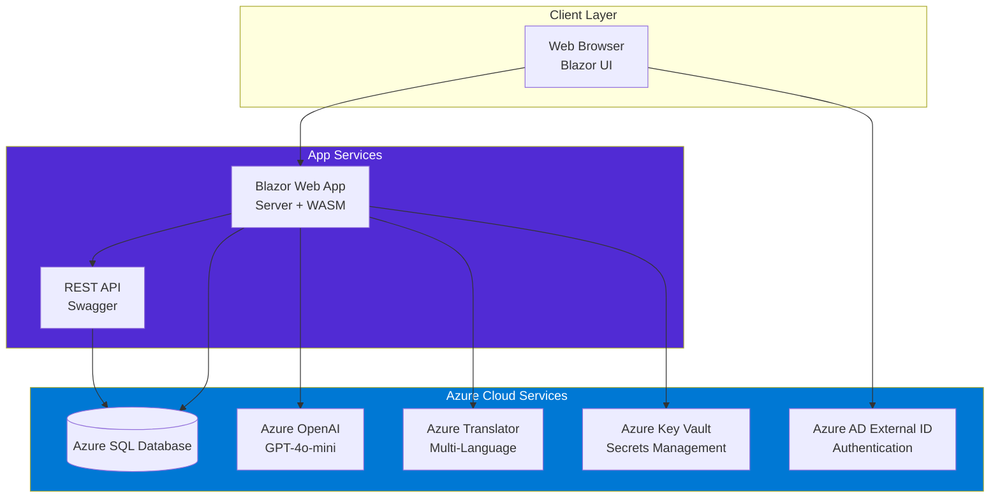
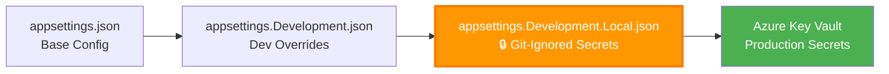
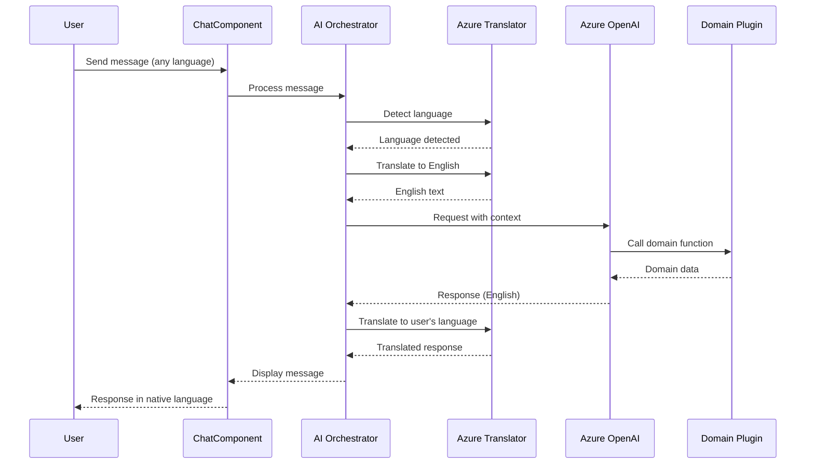

<div align="center">

# 🌍 AidCircle

### Intelligent Aid Coordination Platform

**Connect. Coordinate. Make a Difference.**

[](https://dotnet.microsoft.com/)
[](https://dotnet.microsoft.com/apps/aspnet/web-apps/blazor)
[](https://azure.microsoft.com/)
[](https://azure.microsoft.com/products/ai-services/openai-service)
[](LICENSE)

[Features](#-features) • [Quick Start](#-quick-start) • [Architecture](#-architecture) • [Documentation](#-documentation) • [Contributing](#-contributing)

</div>

---

## 📖 About AidCircle

AidCircle is a **full-stack philanthropic aid coordination platform** that connects volunteers, organizations, and users to streamline resource management and order fulfillment. Built with .NET 8 and powered by Azure AI, AidCircle features an intelligent **multi-language chat assistant** that helps users navigate the platform in 11 languages.

### 🎯 Mission

- **Facilitate Collaboration**: Connect volunteers, organizations, and end-users on a single platform
- **Streamline Resources**: Manage items and orders efficiently, ensuring resources reach those in need
- **Enhance Communication**: Provide clear channels for collaboration with AI-powered assistance
- **Promote Accountability**: Transparent tracking of items, orders, and volunteer efforts

---

## ✨ Features

### 🤖 AI-Powered Multi-Language Chat
> **NEW!** Intelligent assistant supporting 11 languages with automatic detection and translation



**Powered by**:
- **Azure OpenAI** (GPT-4o-mini) - Cost-effective conversational AI
- **Microsoft Semantic Kernel** - Agent plugin architecture
- **Azure AI Translator** - Real-time language detection and translation

**Supported Languages**: English, Spanish, French, German, Chinese, Arabic, Portuguese, Russian, Japanese, Korean, Hindi

### 👥 User & Volunteer Management
- Secure authentication via Azure AD External ID (B2C)
- Volunteer skill tracking and organization assignments
- Role-based access control (Admin, Volunteer, User)

### 🏢 Organization Management
- Multi-address support for complex organizations
- Item and order tracking per organization
- Transparent accountability and reporting

### 📦 Item & Order Management
- Categorize items by type (Todo, Request, Event)
- Aggregate items into fulfillment orders
- Track order status (Pending, InProgress, Completed, Cancelled)
- Assign volunteers and organizations to orders

### 🗺️ Unified Address Management
- Consistent address handling across all entities
- Support for multiple address types (Home, Work, Billing, Shipping, Organization)

---

## 🚀 Quick Start

### Prerequisites

| Tool | Version | Purpose |
|------|---------|---------|
| [.NET SDK](https://dotnet.microsoft.com/download) | 8.0+ | Runtime framework |
| [Visual Studio Code](https://code.visualstudio.com/) | Latest | IDE |
| [Azure CLI](https://docs.microsoft.com/cli/azure/install-azure-cli) | Latest | Azure authentication |
| [SQL Server](https://www.microsoft.com/sql-server) | 2019+ or Azure SQL | Database |

### 1️⃣ Clone Repository

```powershell
git clone https://github.com/KarimFam/aidcircleweb.git
cd aidcircleweb
```

### 2️⃣ Configure Local Secrets

```powershell
# Copy template files
Copy-Item "H4H.Presentation.API\appsettings.Development.Local.json.template" `
          "H4H.Presentation.API\appsettings.Development.Local.json"

Copy-Item "H4H.Presentation.Web\H4H.Presentation.Web\appsettings.Development.Local.json.template" `
          "H4H.Presentation.Web\H4H.Presentation.Web\appsettings.Development.Local.json"

# Edit and add your Azure credentials
code "H4H.Presentation.API\appsettings.Development.Local.json"
code "H4H.Presentation.Web\H4H.Presentation.Web\appsettings.Development.Local.json"
```

> [!TIP]
> See [Local Development Guide](docs/local-development.md) for detailed setup instructions

### 3️⃣ Apply Database Migrations

```powershell
dotnet ef database update --project H4H.Infrastructure --startup-project H4H.Presentation.API
```

### 4️⃣ Run the Applications

```powershell
# Terminal 1: Start API
dotnet run --project H4H.Presentation.API

# Terminal 2: Start Web App
dotnet run --project H4H.Presentation.Web/H4H.Presentation.Web
```

### 5️⃣ Access the Platform

- **Web App**: http://localhost:5011
- **API**: http://localhost:5135
- **Swagger**: http://localhost:5135/swagger

---

## 🏗️ Architecture

AidCircle follows **Clean Architecture** principles with strict separation of concerns:



### Layer Responsibilities

| Layer | Purpose | Dependencies |
|-------|---------|--------------|
| **🟢 Domain** | Pure business logic, entities, enums | None |
| **🔵 Application** | Services, DTOs, orchestration interfaces | Domain only |
| **🟠 Infrastructure** | Data access, AI services, external integrations | Domain + Application |
| **🟣 Presentation** | UI components, API controllers | Application + Infrastructure (DI) |

**Key Principle**: Inner layers never depend on outer layers. Domain has zero external dependencies.

---

## 🎨 System Architecture



### Technology Stack

**Backend**:
- .NET 8.0 | C# 12.0 | Entity Framework Core 8.0.7
- Microsoft Semantic Kernel 1.25.0 (AI orchestration)
- AutoMapper 13.0.1 (object mapping)

**Frontend**:
- Blazor Server (server-side rendering)
- Blazor WebAssembly (client-side interactivity)
- Bootstrap 5 (UI framework)

**Azure Services**:
- Azure SQL Database | Azure OpenAI | Azure AI Translator
- Azure AD External ID (B2C) | Azure Key Vault

---

## 📚 Documentation

| Document | Description |
|----------|-------------|
| [Architecture Overview](docs/architecture-overview.md) | Clean architecture, layer responsibilities, domain model, design patterns |
| [Local Development Setup](docs/local-development.md) | Prerequisites, secrets management, running locally, troubleshooting |
| [AI Chat Deep Dive](docs/ai-chat.md) | Multi-language chat flow, Semantic Kernel integration, agent plugins |
| [Deployment Guide](docs/deployment.md) | Azure resource setup, Key Vault configuration, CI/CD pipeline |

---

## 🎯 Configuration

AidCircle uses **multi-tier configuration loading** for secure secrets management:



> [!IMPORTANT]
> `appsettings.Development.Local.json` files contain your personal Azure credentials and are **NEVER committed** to source control.

**Configuration Priority** (lowest to highest):
1. `appsettings.json` - Base configuration (committed)
2. `appsettings.Development.json` - Dev defaults (committed)
3. `appsettings.Development.Local.json` - 🔒 **Your local secrets** (git-ignored)
4. Azure Key Vault - Production secrets (managed identity access)

See [Local Development Setup](docs/local-development.md#secrets-management) for details.

---

## 🌟 AI Chat Features

### Conversation Flow



### Agent Capabilities

AidCircle's AI assistant can:
- ✅ Provide platform statistics and guidance
- ✅ Explain volunteer creation workflows
- ✅ Assist with order management
- ✅ Answer domain-specific questions
- ✅ Communicate in 11 languages seamlessly

**Performance**: ~2-4 second response time | ~300 tokens per request | ~$0.003 per conversation

See [AI Chat Deep Dive](docs/ai-chat.md) for implementation details.

---

## 🛠️ Project Structure

```
aidcircleweb/
├── H4H.Domain/                 # 🟢 Domain Layer (Pure Business Logic)
│   ├── Entities/               # User, Order, ChatSession, etc.
│   ├── Enums/                  # ItemType, ChatLanguage, etc.
│   └── Interfaces/             # Repository contracts
│
├── H4H.Application/            # 🔵 Application Layer (Services & DTOs)
│   ├── Services/               # Business services
│   ├── Interfaces/             # Service contracts
│   ├── DTOs/                   # Data transfer objects
│   └── Mappers/                # AutoMapper profiles
│
├── H4H.Infrastructure/         # 🟠 Infrastructure Layer (Data & AI)
│   ├── Data/Contexts/          # EF Core DbContext
│   ├── Migrations/             # Database migrations
│   ├── Repositories/           # Repository implementations
│   └── Services/               # AI & external services
│       ├── ChatOrchestrationService.cs
│       ├── AzureTranslatorService.cs
│       └── Plugins/            # Semantic Kernel plugins
│
├── H4H.Presentation.API/       # 🟣 REST API
│   ├── Controllers/            # API endpoints
│   └── Program.cs              # API startup
│
├── H4H.Presentation.Web/       # 🟣 Blazor Web
│   ├── H4H.Presentation.Web/          # Server project
│   │   ├── Components/Pages/          # Razor pages
│   │   └── Program.cs                 # Web startup
│   └── H4H.Presentation.Web.Client/   # WASM project
│
└── docs/                       # 📚 Documentation
    ├── architecture-overview.md
    ├── local-development.md
    ├── ai-chat.md
    └── deployment.md
```

---

## 🤝 Contributing

We welcome contributions! Here's how to get started:

1. **Fork the repository**
2. **Create a feature branch** (`git checkout -b feature/amazing-feature`)
3. **Make your changes** following our coding standards
4. **Test thoroughly** (run both API and Web locally)
5. **Commit your changes** (`git commit -m 'Add amazing feature'`)
6. **Push to your branch** (`git push origin feature/amazing-feature`)
7. **Open a Pull Request**

### Development Guidelines

- Follow **Clean Architecture** principles
- Maintain **layer separation** (Domain never depends on outer layers)
- Use **AutoMapper** for entity ↔ DTO mapping
- Call `SaveChangesAsync()` immediately in repositories
- Add `[KernelFunction]` attributes for new AI plugins
- Update documentation for major features

See [Architecture Overview](docs/architecture-overview.md#design-patterns) for design patterns.

---

## 📋 Prerequisites for Azure Deployment

To deploy AidCircle to Azure, you'll need:

- ✅ **Azure Subscription** with Contributor access
- ✅ **Azure SQL Database** instance
- ✅ **Azure OpenAI** resource with GPT-4o-mini deployment
- ✅ **Azure AI Translator** resource
- ✅ **Azure AD External ID (B2C)** tenant configured
- ✅ **Azure Key Vault** for production secrets

See [Deployment Guide](docs/deployment.md) for step-by-step instructions.

---

## 🐛 Troubleshooting

### Common Issues

| Issue | Solution |
|-------|----------|
| Missing local secrets file | Copy `.template` files to `.json` and populate |
| SQL connection errors | Verify connection string in local config |
| Azure AD redirect loop | Ensure `Instance` ends with `/` |
| OpenAI 404 errors | Verify `DeploymentName` matches Azure portal |
| Translation 401 errors | Check `AzureTranslator:Key` is correct |

See [Local Development Guide - Troubleshooting](docs/local-development.md#troubleshooting) for detailed solutions.

---

## 📄 License

This project is licensed under the **MIT License** - see the [LICENSE](LICENSE) file for details.

---

## 🙏 Acknowledgments

- **Microsoft Semantic Kernel** - AI orchestration framework
- **Azure OpenAI** - GPT-4o-mini chat completions
- **Azure AI Translator** - Multi-language support
- **Blazor** - Modern web UI framework
- **Entity Framework Core** - ORM for .NET

---

## 📞 Support

- **Documentation**: [docs/](docs/)
- **Issues**: [GitHub Issues](https://github.com/KarimFam/aidcircleweb/issues)
- **Email**: [Contact Us](mailto:support@aidcircle.org)

---

<div align="center">

**Built with ❤️ using .NET 8, Blazor, and Azure AI**

[⬆ Back to Top](#-aidcircle)

</div>