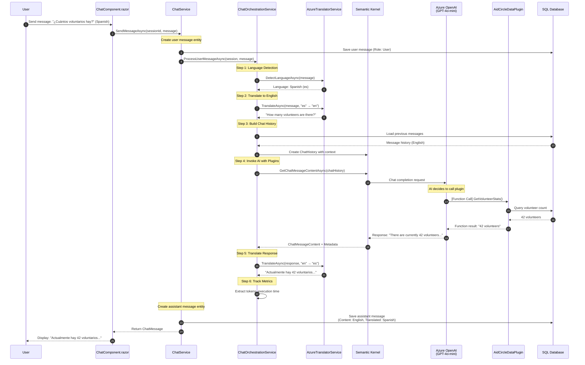
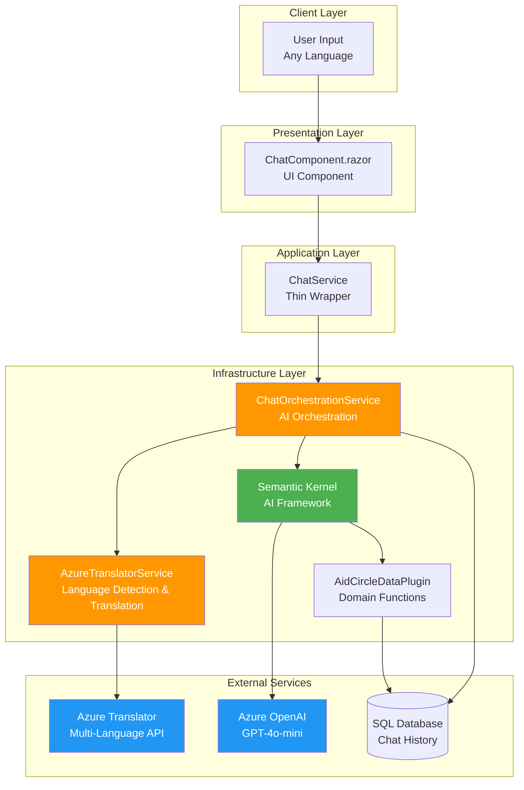
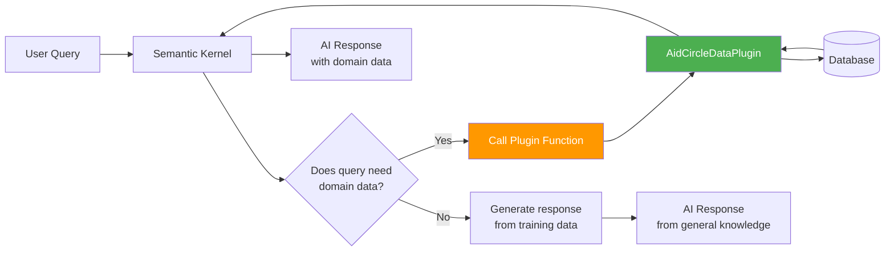
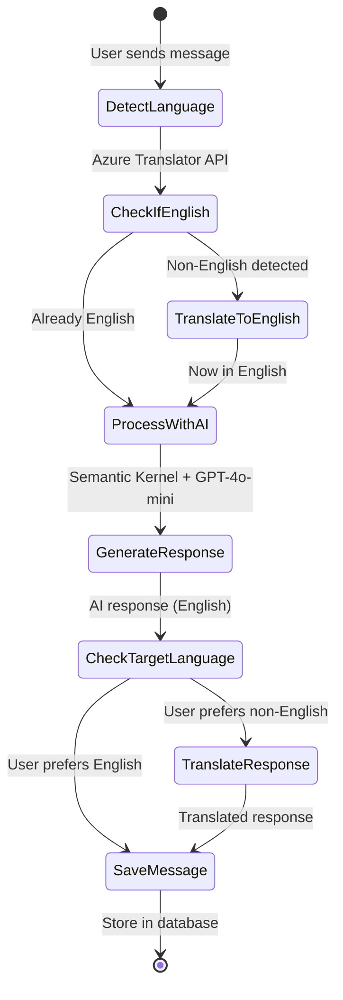

# AI Chat Deep Dive

## Table of Contents
- [Overview](#overview)
- [Multi-Language Chat Flow](#multi-language-chat-flow)
- [Semantic Kernel Integration](#semantic-kernel-integration)
- [Agent Plugins](#agent-plugins)
- [Translation Service](#translation-service)
- [Performance & Monitoring](#performance--monitoring)
- [Extending the System](#extending-the-system)
- [Troubleshooting](#troubleshooting)

## Overview

AidCircle's AI Chat is a sophisticated multi-language conversational assistant powered by:

- **Azure OpenAI GPT-4o-mini** - Cost-effective, fast chat completions
- **Microsoft Semantic Kernel** - AI orchestration framework with plugin architecture
- **Azure AI Translator** - Real-time language detection and translation
- **Domain-Specific Agents** - Custom functions providing AidCircle-specific guidance

### Key Features

✨ **Multi-Language Support** - Chat in 11 languages with automatic detection  
🤖 **Context-Aware Responses** - AI maintains conversation history  
🔌 **Extensible Plugins** - Custom agent functions for domain-specific tasks  
⚡ **Real-Time Translation** - Seamless user experience in native language  
📊 **Performance Metrics** - Token usage and execution time tracking  

### Supported Languages

| Language | Code | Native Name |
|----------|------|-------------|
| English | `en` | English |
| Spanish | `es` | Español |
| French | `fr` | Français |
| German | `de` | Deutsch |
| Chinese (Simplified) | `zh-Hans` | 简体中文 |
| Arabic | `ar` | العربية |
| Portuguese | `pt` | Português |
| Russian | `ru` | Русский |
| Japanese | `ja` | 日本語 |
| Korean | `ko` | 한국어 |
| Hindi | `hi` | हिन्दी |

## Multi-Language Chat Flow

### End-to-End Conversation Flow



### Data Flow Architecture



## Semantic Kernel Integration

### Configuration

Located in `ChatOrchestrationService.cs`:

```csharp
var builder = Kernel.CreateBuilder();

// Add Azure OpenAI chat completion
builder.AddAzureOpenAIChatCompletion(
    deploymentName: "gpt-4o-mini",      // Cost-effective model
    endpoint: azureEndpoint,             // From appsettings.json
    apiKey: apiKey                       // From secrets
);

// Register domain-specific plugins
builder.Plugins.AddFromType<AidCircleDataPlugin>();

_kernel = builder.Build();
```

### Execution Settings

Optimized for conversational AI:

```csharp
var executionSettings = new AzureOpenAIPromptExecutionSettings
{
    Temperature = 0.7,      // Balanced creativity/consistency
    MaxTokens = 800,        // Max response length
    TopP = 0.95,            // Nucleus sampling threshold
    FrequencyPenalty = 0,   // No penalty for repetition
    PresencePenalty = 0     // No penalty for topic diversity
};
```

**Parameter Tuning Guide**:

| Parameter | Value | Why |
|-----------|-------|-----|
| `Temperature` | 0.7 | Balanced: not too random (1.0), not too deterministic (0.0) |
| `MaxTokens` | 800 | Enough for detailed responses, keeps costs manageable |
| `TopP` | 0.95 | Allows diverse vocabulary while filtering nonsense |

### Chat History Management

Semantic Kernel uses `ChatHistory` to maintain conversation context:

```csharp
var chatHistory = new ChatHistory();

// Add system message with context
chatHistory.AddSystemMessage(
    "You are AidCircle Assistant, helping users coordinate aid and volunteer efforts. " +
    "Provide helpful, empathetic responses about orders, items, and volunteer coordination."
);

// Load previous messages for context
var previousMessages = await LoadMessageHistoryAsync(session.ChatSessionId);
foreach (var msg in previousMessages)
{
    if (msg.Role == MessageRole.User)
        chatHistory.AddUserMessage(msg.Content);  // Always English
    else
        chatHistory.AddAssistantMessage(msg.Content);
}

// Add current user message
chatHistory.AddUserMessage(translatedMessage);
```

**Why English-Only History?**:
- Reduces token count (no redundant translations)
- Simplifies context management
- More accurate AI understanding (no mixed languages)

## Agent Plugins

### AidCircleDataPlugin

Domain-specific functions that GPT-4o-mini can call to answer AidCircle questions.

**Location**: `H4H.Infrastructure/Services/Plugins/AidCircleDataPlugin.cs`

### Available Functions

#### 1. GetVolunteerStats

Returns current volunteer statistics.

```csharp
[KernelFunction, Description("Get current volunteer statistics and platform metrics")]
public async Task<string> GetVolunteerStats()
{
    var volunteers = await _volunteerRepository.GetAllAsync();
    var activeCount = volunteers.Count(v => v.IsActive);
    
    return $"Platform has {volunteers.Count} total volunteers, " +
           $"{activeCount} are currently active.";
}
```

**Example User Query**: "How many volunteers do we have?"

**AI Response**: "We currently have 42 volunteers on the platform, with 38 actively helping. Would you like to see how to become a volunteer?"

#### 2. GetOrderGuidance

Provides guidance on order management.

```csharp
[KernelFunction, Description("Get guidance on creating and managing orders")]
public async Task<string> GetOrderGuidance()
{
    return "To create an order: 1) Navigate to Orders page, " +
           "2) Click 'New Order', 3) Select items and assign volunteer, " +
           "4) Set delivery address. Track order status in real-time.";
}
```

**Example User Query**: "How do I create an order?"

**AI Response**: *Uses plugin result to provide step-by-step guidance*

### Plugin Architecture



### Creating a New Plugin Function

**Step 1**: Add method to `AidCircleDataPlugin.cs`

```csharp
[KernelFunction]
[Description("Get statistics about items in the system")]
public async Task<string> GetItemStats()
{
    var items = await _itemRepository.GetAllAsync();
    var byType = items.GroupBy(i => i.Type)
                     .Select(g => $"{g.Key}: {g.Count()}");
    
    return $"Item breakdown: {string.Join(", ", byType)}";
}
```

**Step 2**: No registration needed! Semantic Kernel auto-discovers via `[KernelFunction]`

**Step 3**: Test by asking AI: "How many items do we have?"

### Plugin Execution Metadata

After plugin calls, metadata is stored in `ChatMessage.AgentMetadata`:

```json
{
  "PluginCalled": "AidCircleDataPlugin.GetVolunteerStats",
  "ExecutionTimeMs": 42,
  "Result": "Platform has 42 total volunteers, 38 are currently active."
}
```

## Translation Service

### AzureTranslatorService

**Location**: `H4H.Infrastructure/Services/AzureTranslatorService.cs`

### Core Methods

#### DetectAndTranslateAsync

Auto-detects language and translates to target:

```csharp
public async Task<(string translatedText, string detectedLanguage)> 
    DetectAndTranslateAsync(string text, string targetLanguage)
{
    // 1. Detect source language
    var detectedLang = await DetectLanguageAsync(text);
    
    // 2. Skip translation if already target language
    if (detectedLang == targetLanguage)
        return (text, detectedLang);
    
    // 3. Translate to target
    var translated = await TranslateAsync(text, detectedLang, targetLanguage);
    return (translated, detectedLang);
}
```

#### TranslateAsync

Direct translation between two languages:

```csharp
public async Task<string> TranslateAsync(
    string text, 
    string fromLanguage, 
    string toLanguage)
{
    var route = $"/translate?api-version=3.0&from={fromLanguage}&to={toLanguage}";
    
    var requestBody = new object[] { new { Text = text } };
    var response = await _httpClient.PostAsJsonAsync(route, requestBody);
    
    // Parse response and extract translated text
    var result = await response.Content.ReadFromJsonAsync<TranslationResult[]>();
    return result[0].Translations[0].Text;
}
```

#### DetectLanguageAsync

Identifies the language of input text:

```csharp
public async Task<string> DetectLanguageAsync(string text)
{
    var route = "/detect?api-version=3.0";
    var requestBody = new object[] { new { Text = text } };
    
    var response = await _httpClient.PostAsJsonAsync(route, requestBody);
    var result = await response.Content.ReadFromJsonAsync<DetectionResult[]>();
    
    return result[0].Language;  // Returns "es", "fr", etc.
}
```

### ChatLanguage Enum Extensions

Convert between `ChatLanguage` enum and Azure Translator language codes:

```csharp
public static class ChatLanguageExtensions
{
    public static string ToLanguageCode(this ChatLanguage language)
    {
        return language switch
        {
            ChatLanguage.English => "en",
            ChatLanguage.Spanish => "es",
            ChatLanguage.French => "fr",
            ChatLanguage.German => "de",
            ChatLanguage.Chinese => "zh-Hans",
            ChatLanguage.Arabic => "ar",
            // ... other languages
        };
    }
    
    public static ChatLanguage FromLanguageCode(string code)
    {
        return code switch
        {
            "en" => ChatLanguage.English,
            "es" => ChatLanguage.Spanish,
            // ... other codes
            _ => ChatLanguage.English  // Default fallback
        };
    }
}
```

### Translation Flow



## Performance & Monitoring

### Token Usage Tracking

Every AI interaction tracks token consumption:

```csharp
var tokensUsed = 0;
if (result.Metadata?.ContainsKey("Usage") == true)
{
    var usage = result.Metadata["Usage"];
    if (usage != null)
    {
        var usageDict = usage as IDictionary<string, object>;
        if (usageDict != null)
        {
            if (usageDict.ContainsKey("TotalTokenCount"))
                tokensUsed = Convert.ToInt32(usageDict["TotalTokenCount"]);
        }
    }
}
```

Stored in `ChatMessage.TokensUsed` for cost analysis.

### Execution Time Tracking

```csharp
var stopwatch = Stopwatch.StartNew();

// AI processing...
var result = await chatCompletion.GetChatMessageContentAsync(...);

stopwatch.Stop();
var executionTimeMs = (int)stopwatch.ElapsedMilliseconds;
```

Stored in `ChatMessage.ExecutionTimeMs` for performance monitoring.

### Performance Metrics Table

| Metric | Typical Value | Acceptable Range | Action if Exceeded |
|--------|---------------|------------------|-------------------|
| **Response Time** | 2-4 seconds | < 8 seconds | Reduce chat history size |
| **Tokens per Request** | 200-500 | < 1000 | Shorten system prompt |
| **Translation Time** | 100-300ms | < 500ms | Check network latency |
| **Plugin Execution** | 50-200ms | < 1000ms | Optimize database queries |

### Cost Optimization

**GPT-4o-mini Pricing** (as of Nov 2024):
- Input: $0.15 per 1M tokens
- Output: $0.60 per 1M tokens

**Average Conversation Cost**:
- 10 messages × 300 tokens/message = 3,000 tokens
- Cost: ~$0.002 per conversation

**Azure Translator Pricing**:
- $10 per 1M characters
- Average message: 50 characters
- Cost: ~$0.0005 per translation

**Total Cost per Conversation**: ~$0.003 (less than 1 cent)

## Extending the System

### Add a New Language

**Step 1**: Add to `ChatLanguage` enum (`H4H.Domain/Enums/ChatLanguage.cs`):

```csharp
[EnumMember(Value = "Italian")]
[JsonPropertyName("it")]
Italian
```

**Step 2**: Add to extension methods (`AzureTranslatorService.cs`):

```csharp
public static string ToLanguageCode(this ChatLanguage language)
{
    return language switch
    {
        // ... existing languages
        ChatLanguage.Italian => "it",
        _ => "en"
    };
}
```

**Step 3**: Create database migration:

```powershell
dotnet ef migrations add AddItalianLanguage --project H4H.Infrastructure --startup-project H4H.Presentation.API
dotnet ef database update --project H4H.Infrastructure --startup-project H4H.Presentation.API
```

### Add a New Plugin Function

**Use Case**: Let AI answer "What's my order status?"

```csharp
[KernelFunction]
[Description("Get the status of a user's most recent order")]
public async Task<string> GetUserOrderStatus(
    [Description("The user's ID")] string userId)
{
    var orders = await _orderRepository.GetByUserIdAsync(Guid.Parse(userId));
    var latestOrder = orders.OrderByDescending(o => o.OrderDate).FirstOrDefault();
    
    if (latestOrder == null)
        return "No orders found for this user.";
    
    return $"Order {latestOrder.OrderNumber}: Status is {latestOrder.Status}. " +
           $"Placed on {latestOrder.OrderDate:MMMM dd, yyyy}.";
}
```

**Testing**: Ask AI "What's the status of my latest order?"

### Switch to GPT-4 (Higher Quality)

Edit `appsettings.json`:

```json
{
  "AzureOpenAI": {
    "DeploymentName": "gpt-4"  // Change from gpt-4o-mini
  }
}
```

**Trade-offs**:
- ✅ Higher quality responses
- ✅ Better reasoning capabilities
- ❌ ~10x higher cost
- ❌ Slower response times

### Enable Response Streaming

For real-time token-by-token display (future enhancement):

```csharp
await foreach (var message in chatCompletion.GetStreamingChatMessageContentsAsync(chatHistory))
{
    Console.Write(message.Content);
    // Send to client via SignalR for real-time UI update
}
```

## Troubleshooting

### Common Issues

| Issue | Symptoms | Solution |
|-------|----------|----------|
| **401 Unauthorized (OpenAI)** | `Service request failed: 401` | Verify `AzureOpenAI:ApiKey` in local config |
| **401 Unauthorized (Translator)** | `Translation failed: 401` | Verify `AzureTranslator:Key` in local config |
| **404 Deployment Not Found** | `DeploymentNotFound` | Ensure `DeploymentName` matches Azure portal |
| **TotalTokens error** | `'ChatTokenUsage' does not contain 'TotalTokens'` | Pull latest code (fixed in recent commit) |
| **No plugin calls** | AI doesn't use custom functions | Check `[KernelFunction]` attribute present |
| **Slow responses** | > 10 seconds per message | Reduce chat history size or increase `MaxTokens` |
| **Translation errors** | Messages not translating | Verify language code format (e.g., "zh-Hans" not "zh") |

### Debugging Chat Issues

**Enable verbose logging**:

Add to `appsettings.Development.json`:

```json
{
  "Logging": {
    "LogLevel": {
      "H4H.Infrastructure.Services.ChatOrchestrationService": "Debug",
      "H4H.Infrastructure.Services.AzureTranslatorService": "Debug"
    }
  }
}
```

**Test translation directly**:

```csharp
var translator = new AzureTranslatorService(config);
var result = await translator.TranslateAsync("Hello", "en", "es");
Console.WriteLine(result);  // Should print: "Hola"
```

**Test Semantic Kernel connection**:

```csharp
var kernel = CreateKernel();
var result = await kernel.InvokePromptAsync("Say hello");
Console.WriteLine(result);  // Should print AI response
```

### Performance Profiling

**Measure translation time**:

```csharp
var sw = Stopwatch.StartNew();
var translated = await _translatorService.TranslateAsync(text, "en", "es");
Console.WriteLine($"Translation took {sw.ElapsedMilliseconds}ms");
```

**Measure AI response time**:

```csharp
var sw = Stopwatch.StartNew();
var result = await chatCompletion.GetChatMessageContentAsync(chatHistory);
Console.WriteLine($"AI response took {sw.ElapsedMilliseconds}ms");
Console.WriteLine($"Tokens used: {result.Metadata["Usage"]["TotalTokenCount"]}");
```

## Next Steps

- 🚀 **Deploy to Production** → See [Deployment Guide](deployment.md)
- 🏗️ **Understand the Architecture** → Read [Architecture Overview](architecture-overview.md)
- 💻 **Set Up Local Environment** → Follow [Local Development Guide](local-development.md)
