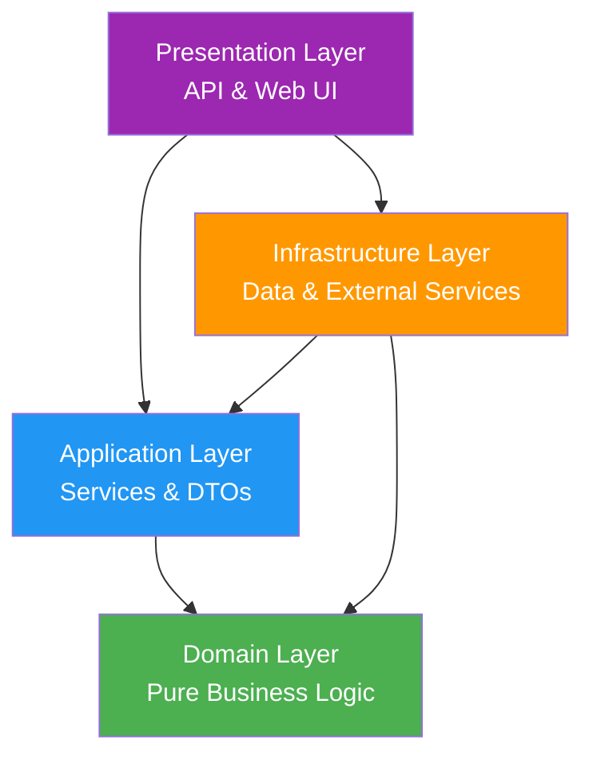
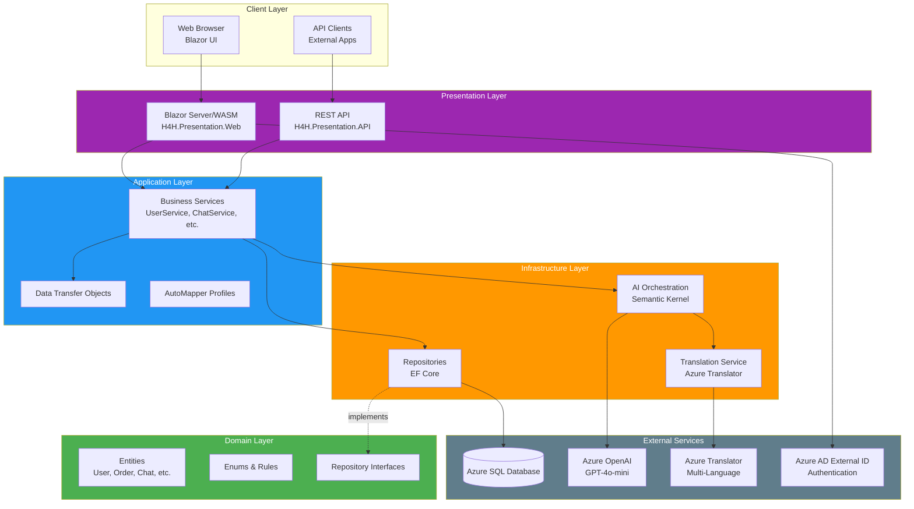
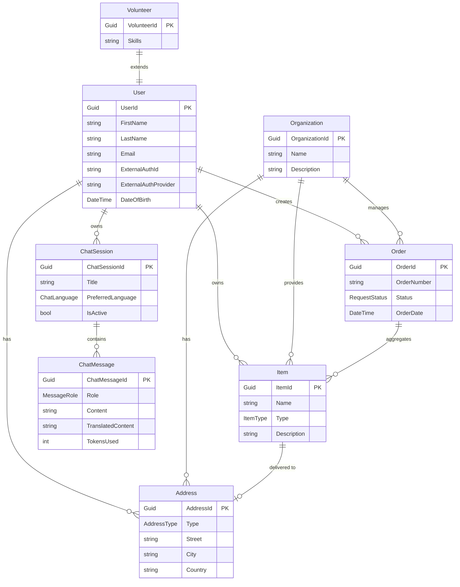
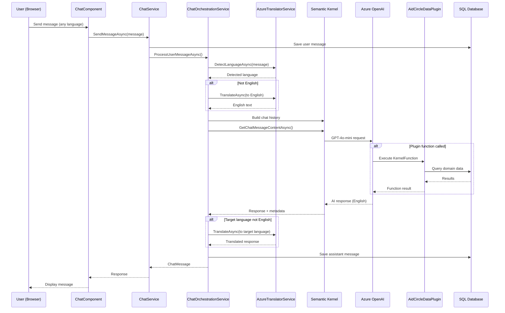

# Architecture Overview

## Table of Contents
- [Clean Architecture](#clean-architecture)
- [Layer Responsibilities](#layer-responsibilities)
- [System Architecture Diagram](#system-architecture-diagram)
- [Domain Model](#domain-model)
- [AI Chat Architecture](#ai-chat-architecture)
- [Technology Stack](#technology-stack)

## Clean Architecture

AidCircle follows **Clean Architecture** principles to maintain separation of concerns, testability, and flexibility. The solution is organized into four distinct layers with strict dependency rules.

### Dependency Flow



**Key Principle**: Inner layers never depend on outer layers. Domain is the core with zero external dependencies.

## Layer Responsibilities

### 🟢 Domain Layer (`H4H.Domain`)
**Purpose**: Core business entities, enums, and repository contracts

**Contains**:
- **Entities**: `User`, `Volunteer`, `Organization`, `Item`, `Order`, `Address`, `ChatSession`, `ChatMessage`
- **Enums**: `ItemType`, `RequestStatus`, `AddressType`, `RoleType`, `ChatLanguage`, `MessageRole`
- **Interfaces**: Repository contracts (`IUserRepository`, `IChatSessionRepository`, etc.)

**Rules**:
- ✅ Pure C# POCOs representing business concepts
- ✅ All entities inherit from `BaseEntity` (CreatedDate, ModifiedDate)
- ❌ NO references to Application, Infrastructure, or Presentation layers
- ❌ NO EF Core, Azure SDK, or external library dependencies

### 🔵 Application Layer (`H4H.Application`)
**Purpose**: Business services, DTOs, orchestration interfaces, and mapping

**Contains**:
- **Services**: `UserService`, `OrderService`, `ChatService`, etc.
- **Interfaces**: Service contracts and orchestration interfaces
- **DTOs**: Data transfer objects for all entities
- **Mappers**: AutoMapper profiles for entity ↔ DTO conversion

**Pattern**: Services are thin wrappers over repositories - NO complex business logic

**Rules**:
- ✅ References ONLY Domain layer
- ✅ Defines interfaces that Infrastructure implements (e.g., `IChatOrchestrationService`)
- ❌ NO direct database or external service access

### 🟠 Infrastructure Layer (`H4H.Infrastructure`)
**Purpose**: Data persistence, external services, and AI orchestration

**Contains**:
- **Data Layer**: `H4HDbContext`, EF Core migrations
- **Repositories**: Concrete implementations of Domain interfaces
- **AI Services**: 
  - `ChatOrchestrationService` - Semantic Kernel integration
  - `AzureTranslatorService` - Multi-language translation
  - `AidCircleDataPlugin` - Domain-specific agent functions
- **External Integrations**: Azure OpenAI, Azure Translator

**Critical Pattern**: Repositories call `SaveChangesAsync()` immediately after Add/Update/Delete

**Rules**:
- ✅ References both Domain AND Application layers
- ✅ Implements repository interfaces from Domain
- ✅ Implements orchestration services for Application

### 🟣 Presentation Layer
**Purpose**: User interfaces and API endpoints

**Projects**:
- **`H4H.Presentation.API`**: REST API with Swagger
- **`H4H.Presentation.Web`**: Blazor Server + WebAssembly hybrid

**Pattern**: Controller/Component → Service → Repository

**Rules**:
- ✅ References Application (services) and Infrastructure (DI setup)
- ✅ Uses DTOs for data transfer
- ✅ Controllers/Components inject services via DI

## System Architecture Diagram



## Domain Model

### Core Entities Relationships



### Key Enums

| Enum | Values | Purpose |
|------|--------|---------|
| `ItemType` | Todo, Request, Event | Categorizes items by purpose |
| `RequestStatus` | Pending, InProgress, Completed, Cancelled | Tracks order lifecycle |
| `AddressType` | Home, Work, Billing, Shipping, Organization | Differentiates address usage |
| `RoleType` | Admin, Volunteer, User | User permission levels |
| `ChatLanguage` | English, Spanish, French, German, Chinese, Arabic, Portuguese, Russian, Japanese, Korean, Hindi | Supported chat languages |
| `MessageRole` | User, Assistant, System | Chat message origin |

## AI Chat Architecture

AidCircle features an intelligent multi-language AI assistant powered by Azure OpenAI and Microsoft Semantic Kernel.

### Chat Flow Diagram



### AI Components

**Semantic Kernel Integration**:
- **Model**: GPT-4o-mini (cost-effective conversational AI)
- **Temperature**: 0.7 (balanced creativity/consistency)
- **MaxTokens**: 800 per response
- **Plugin System**: Extensible agent functions

**Agent Plugins** (`AidCircleDataPlugin`):
- `GetVolunteerStats()` - Platform statistics
- `GetOrderGuidance()` - Order management help
- Extensible with `[KernelFunction]` attributes

**Translation Service**:
- **11 Languages Supported**: English, Spanish, French, German, Chinese, Arabic, Portuguese, Russian, Japanese, Korean, Hindi
- **Auto-Detection**: Identifies input language automatically
- **Seamless UX**: Users send/receive in their native language
- **Efficient Context**: Chat history stored in English for token optimization

## Technology Stack

### Backend
| Technology | Version | Purpose |
|------------|---------|---------|
| .NET | 8.0 | Runtime framework |
| C# | 12.0 | Programming language |
| Entity Framework Core | 8.0.7 | ORM for SQL Server |
| AutoMapper | 13.0.1 | Object-to-object mapping |
| Microsoft Semantic Kernel | 1.25.0 | AI orchestration framework |

### Frontend
| Technology | Purpose |
|------------|---------|
| Blazor Server | Server-side rendering |
| Blazor WebAssembly | Client-side interactivity |
| Bootstrap 5 | UI framework |
| Razor Components | Component architecture |

### Azure Services
| Service | Purpose |
|---------|---------|
| Azure SQL Database | Relational data storage |
| Azure OpenAI | GPT-4o-mini chat completions |
| Azure AI Translator | Multi-language translation |
| Azure AD External ID (B2C) | User authentication |
| Azure Key Vault | Production secrets management |

### Development Tools
| Tool | Purpose |
|------|---------|
| Visual Studio Code | IDE |
| Git | Version control |
| Swagger/OpenAPI | API documentation |
| PowerShell | Scripting and automation |

## Project Structure

```
aidcircleweb/
├── H4H.Domain/                 # 🟢 Domain Layer
│   ├── Entities/               # Business entities
│   ├── Enums/                  # Domain enums
│   └── Interfaces/             # Repository contracts
│
├── H4H.Application/            # 🔵 Application Layer
│   ├── Services/               # Business services
│   ├── Interfaces/             # Service contracts
│   ├── DTOs/                   # Data transfer objects
│   └── Mappers/                # AutoMapper profiles
│
├── H4H.Infrastructure/         # 🟠 Infrastructure Layer
│   ├── Data/Contexts/          # EF Core DbContext
│   ├── Migrations/             # Database migrations
│   ├── Repositories/           # Repository implementations
│   └── Services/               # AI & external services
│       ├── ChatOrchestrationService.cs
│       ├── AzureTranslatorService.cs
│       └── Plugins/            # Semantic Kernel plugins
│
├── H4H.Presentation.API/       # 🟣 REST API
│   ├── Controllers/            # API endpoints
│   └── Program.cs              # API startup
│
├── H4H.Presentation.Web/       # 🟣 Blazor Web
│   ├── H4H.Presentation.Web/   # Server project
│   │   ├── Components/Pages/   # Razor pages
│   │   └── Program.cs          # Web startup
│   └── H4H.Presentation.Web.Client/  # WASM project
│
└── docs/                       # 📚 Documentation
    ├── architecture-overview.md
    ├── local-development.md
    ├── ai-chat.md
    └── deployment.md
```

## Design Patterns

### Repository Pattern
- **Interface Definition**: Domain layer (`IUserRepository`)
- **Implementation**: Infrastructure layer (`UserRepository`)
- **Benefit**: Swappable data sources (SQL Server ↔ Cosmos DB)

**Critical Rule**: Repositories MUST call `SaveChangesAsync()` immediately after modifications:

```csharp
public async Task AddAsync(ChatMessage entity) {
    await _context.ChatMessages.AddAsync(entity);
    await _context.SaveChangesAsync(); // ✅ REQUIRED
}
```

### Service Layer Pattern
Services are **thin wrappers** over repositories:

```csharp
public class ChatService : IChatService {
    private readonly IChatSessionRepository _sessionRepository;
    
    public async Task<ChatSession> GetByIdAsync(Guid id) {
        return await _sessionRepository.GetByIdAsync(id);
    }
}
```

**Why**: Business logic belongs in Domain entities or orchestration services, not CRUD services.

### Dependency Injection
All services registered in `Program.cs`:

```csharp
// Repositories (Scoped)
builder.Services.AddScoped<IUserRepository, UserRepository>();

// Services (Scoped)
builder.Services.AddScoped<IChatService, ChatService>();

// Singletons (Stateless)
builder.Services.AddSingleton<IAzureTranslatorService, AzureTranslatorService>();
```

## Architectural Decisions & Rationale

### Why Clean Architecture?
- **Testability**: Inner layers can be unit tested without external dependencies
- **Flexibility**: Swap implementations (e.g., SQL Server → Cosmos DB) without changing business logic
- **Maintainability**: Clear separation of concerns reduces cognitive load

**Trade-off**: Initial complexity, but pays dividends as project grows.

### Why SQL Server First, Cosmos DB Ready?
- **SQL Server**: Proven relational model for User → Order → Item relationships
- **Future Cosmos DB**: Repository pattern allows swapping if scale demands (millions of chat messages)

### Why Semantic Kernel Over LangChain?
- **Microsoft Ecosystem**: Tight Azure OpenAI integration, .NET native
- **Plugin Architecture**: `[KernelFunction]` cleaner than LangChain's chains/agents
- **Cost Efficiency**: GPT-4o-mini recommended as cost-effective

**Trade-off**: Less Python community support than LangChain.

### Why Multi-Language Translation?
- **User Experience**: Users send/receive in native language
- **Cost**: Azure Translator cheaper than multi-lingual LLM training
- **Context Management**: English-only chat history simplifies Semantic Kernel context

**Trade-off**: Extra Azure service dependency, translation latency.

### Why Blazor Hybrid (Server + WASM)?
- **Server-Side**: Fast initial load, secure server operations
- **WASM**: Client-side interactivity where needed (chat UI)

**Trade-off**: Complexity of managing two rendering modes.

## Next Steps

- **[Local Development Setup](local-development.md)** - Get started with development environment
- **[AI Chat Deep Dive](ai-chat.md)** - Understand the AI chat implementation
- **[Deployment Guide](deployment.md)** - Deploy to Azure production
