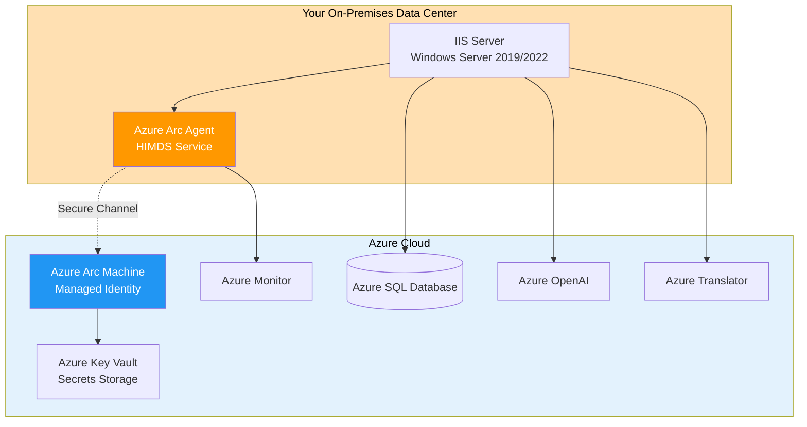
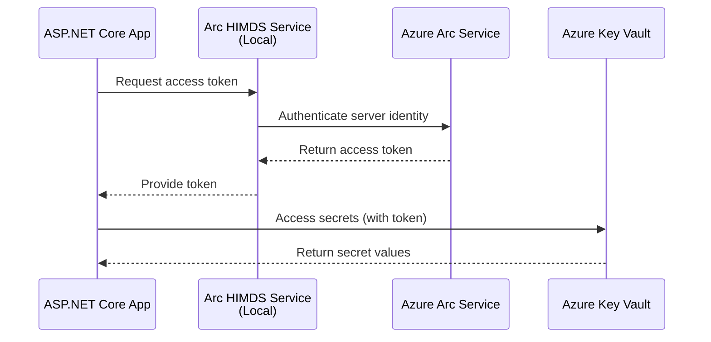

# IIS Deployment with Azure Arc Managed Identity

## Table of Contents
- [Overview](#overview)
- [Prerequisites](#prerequisites)
- [Azure Arc Setup](#azure-arc-setup)
- [IIS Configuration](#iis-configuration)
- [Application Deployment](#application-deployment)
- [Key Vault Integration](#key-vault-integration)
- [Troubleshooting](#troubleshooting)

## Overview

This guide explains how to deploy AidCircle to your **own Windows Server with IIS** while still leveraging **Azure Key Vault** and other Azure services through **Azure Arc-enabled managed identity**.

### What is Azure Arc?

Azure Arc extends Azure management and services to any infrastructure, including on-premises servers. For AidCircle, this means:

- ✅ Your IIS server gets a **managed identity** (just like Azure App Services)
- ✅ Access **Azure Key Vault** without storing secrets locally
- ✅ Use **Azure Monitor**, **Azure Policy**, and **Azure Security Center**
- ✅ Keep your server on-premises (no need to migrate to Azure)

### Architecture Diagram



---

## Prerequisites

### Hardware & Software Requirements

| Requirement | Specification |
|-------------|---------------|
| **OS** | Windows Server 2019 or 2022 |
| **RAM** | Minimum 4 GB (8 GB recommended) |
| **Disk** | 10 GB free space |
| **.NET Hosting Bundle** | .NET 8.0 Hosting Bundle |
| **IIS** | Version 10.0+ with ASP.NET Core Module |
| **PowerShell** | Version 5.1+ (7.x recommended) |
| **Network** | Outbound HTTPS (443) to Azure endpoints |

### Azure Requirements

- ✅ **Azure Subscription** with Contributor access
- ✅ **Azure CLI** installed (`az` version 2.59+)
- ✅ **Azure Arc Extension** (`connectedmachine`)
- ✅ **Azure Key Vault** already created (see [main deployment guide](deployment.md#key-vault-configuration))

### Network Requirements

Your IIS server must have **outbound HTTPS access** to these Azure endpoints:

| Endpoint | Purpose |
|----------|---------|
| `management.azure.com` | Azure Resource Manager |
| `login.microsoftonline.com` | Azure AD authentication |
| `*.guestconfiguration.azure.com` | Arc agent communication |
| `*.his.arc.azure.com` | Hybrid Identity Service |
| `*.vault.azure.net` | Key Vault access |

> [!TIP]
> Test connectivity: `Test-NetConnection -ComputerName management.azure.com -Port 443`

---

## Azure Arc Setup

### Step 1: Install Prerequisites on Server

Run these commands on your **Windows Server** (as Administrator):

```powershell
# Install .NET 8 Hosting Bundle
$hostingBundleUrl = "https://download.visualstudio.microsoft.com/download/pr/..."
Invoke-WebRequest -Uri $hostingBundleUrl -OutFile "dotnet-hosting-8.0-win.exe"
Start-Process -FilePath "dotnet-hosting-8.0-win.exe" -ArgumentList "/quiet" -Wait

# Install IIS and ASP.NET Core Module
Install-WindowsFeature -Name Web-Server -IncludeManagementTools
Install-WindowsFeature -Name Web-Asp-Net45

# Restart IIS to load new modules
Restart-Service W3SVC -Force

# Verify installation
dotnet --info
```

### Step 2: Install Azure CLI on Server

```powershell
# Download and install Azure CLI
$msiPath = "$env:TEMP\AzureCLI.msi"
Invoke-WebRequest -Uri "https://aka.ms/installazurecliwindows" -OutFile $msiPath
Start-Process msiexec.exe -ArgumentList "/i $msiPath /quiet" -Wait

# Restart PowerShell session to refresh PATH
# Then verify
az version
```

### Step 3: Register Azure Providers

Run on your **development machine** or the server (after `az login`):

```powershell
# Login to Azure
az login

# Set subscription
$subscriptionId = "YOUR_SUBSCRIPTION_ID"
az account set --subscription $subscriptionId

# Register required providers
az provider register --namespace Microsoft.HybridCompute
az provider register --namespace Microsoft.GuestConfiguration
az provider register --namespace Microsoft.HybridConnectivity

# Wait for registration (check status)
az provider show --namespace Microsoft.HybridCompute --query "registrationState"
```

### Step 4: Install Azure Arc Agent on Server

Back on your **Windows Server**:

```powershell
# Install Arc extension for Azure CLI
az extension add --name connectedmachine

# Define variables
$resourceGroup = "rg-aidcircle-prod"
$location = "eastus"
$machineName = "arc-aidcircle-iis01"  # Unique name for your server
$subscriptionId = "YOUR_SUBSCRIPTION_ID"
$tenantId = "YOUR_TENANT_ID"

# Generate onboarding script
az connectedmachine connect `
  --resource-group $resourceGroup `
  --location $location `
  --name $machineName `
  --subscription $subscriptionId `
  --tenant $tenantId
```

> [!IMPORTANT]
> The `az connectedmachine connect` command will:
> 1. Download the Arc agent installer
> 2. Install the agent as a Windows service
> 3. Register the server in Azure
> 4. Display the resource ID (save this!)

### Step 5: Verify Arc Registration

```powershell
# Check Arc agent status locally
azcmagent show

# Check in Azure (from any machine with Azure CLI)
az connectedmachine show `
  --name $machineName `
  --resource-group $resourceGroup

# Verify in Azure Portal
# Navigate to: Azure Arc > Servers > [your machine name]
```

You should see your server listed with status **Connected**.

### Step 6: Enable System-Assigned Managed Identity

```powershell
# Enable managed identity on Arc-enabled server
az connectedmachine identity assign `
  --name $machineName `
  --resource-group $resourceGroup

# Get the Principal ID (save this for Key Vault access)
$principalId = az connectedmachine show `
  --name $machineName `
  --resource-group $resourceGroup `
  --query identity.principalId -o tsv

Write-Host "Managed Identity Principal ID: $principalId" -ForegroundColor Green
```

---

## Key Vault Integration

### Grant Arc Managed Identity Access to Key Vault

```powershell
$vaultName = "kv-aidcircle-prod"

# Grant Key Vault access to Arc server's managed identity
az keyvault set-policy `
  --name $vaultName `
  --object-id $principalId `
  --secret-permissions get list

# Verify access policy
az keyvault show `
  --name $vaultName `
  --query "properties.accessPolicies[?objectId=='$principalId']"
```

### How Managed Identity Works on Arc Servers

When your ASP.NET Core app runs on the Arc-enabled IIS server:

1. **App requests token**: `DefaultAzureCredential` detects Arc environment
2. **Local HIMDS service**: Arc agent runs a local identity service (similar to Azure IMDS)
3. **Token exchange**: HIMDS contacts Azure to get a token for the managed identity
4. **Key Vault access**: App uses token to authenticate to Key Vault



---

## IIS Configuration

### Step 1: Create Application Folder Structure

```powershell
# Create directories
New-Item -Path "C:\inetpub\aidcircle" -ItemType Directory -Force
New-Item -Path "C:\inetpub\aidcircle\api" -ItemType Directory -Force
New-Item -Path "C:\inetpub\aidcircle\web" -ItemType Directory -Force

# Set permissions (IIS_IUSRS needs read/execute)
icacls "C:\inetpub\aidcircle" /grant "IIS_IUSRS:(OI)(CI)RX" /T
```

### Step 2: Create Application Pools

```powershell
# Import IIS module
Import-Module WebAdministration

# Create API App Pool
New-WebAppPool -Name "AidCircleApiPool"
Set-ItemProperty IIS:\AppPools\AidCircleApiPool -Name managedRuntimeVersion -Value ""
Set-ItemProperty IIS:\AppPools\AidCircleApiPool -Name managedPipelineMode -Value "Integrated"
Set-ItemProperty IIS:\AppPools\AidCircleApiPool -Name processModel.identityType -Value "ApplicationPoolIdentity"

# Create Web App Pool
New-WebAppPool -Name "AidCircleWebPool"
Set-ItemProperty IIS:\AppPools\AidCircleWebPool -Name managedRuntimeVersion -Value ""
Set-ItemProperty IIS:\AppPools\AidCircleWebPool -Name managedPipelineMode -Value "Integrated"
Set-ItemProperty IIS:\AppPools\AidCircleWebPool -Name processModel.identityType -Value "ApplicationPoolIdentity"
```

> [!NOTE]
> `managedRuntimeVersion = ""` means "No Managed Code" (correct for .NET Core/8)

### Step 3: Create IIS Websites

```powershell
# Create API Website
New-Website -Name "AidCircle API" `
  -PhysicalPath "C:\inetpub\aidcircle\api" `
  -ApplicationPool "AidCircleApiPool" `
  -Port 5135

# Create Web Website
New-Website -Name "AidCircle Web" `
  -PhysicalPath "C:\inetpub\aidcircle\web" `
  -ApplicationPool "AidCircleWebPool" `
  -Port 5011

# Verify sites
Get-Website | Where-Object { $_.Name -like "AidCircle*" }
```

### Step 4: Configure HTTPS (Optional but Recommended)

```powershell
# Create self-signed certificate for testing
$cert = New-SelfSignedCertificate `
  -DnsName "aidcircle.local" `
  -CertStoreLocation "Cert:\LocalMachine\My"

# Bind HTTPS to Web site
New-WebBinding -Name "AidCircle Web" `
  -Protocol https `
  -Port 443 `
  -SslFlags 0

# Assign certificate
$binding = Get-WebBinding -Name "AidCircle Web" -Protocol https
$binding.AddSslCertificate($cert.Thumbprint, "My")
```

For production, use a **real SSL certificate** from Let's Encrypt or a CA.

---

## Application Deployment

### Step 1: Build and Publish from Dev Machine

On your **development machine**:

```powershell
# Navigate to solution root
cd O:\source\repos\aidcircleweb

# Clean previous builds
dotnet clean H4H.sln --configuration Release

# Restore dependencies
dotnet restore H4H.sln

# Publish API
dotnet publish H4H.Presentation.API/H4H.Presentation.API.csproj `
  --configuration Release `
  --output "C:\temp\publish\api" `
  --runtime win-x64 `
  --self-contained false

# Publish Web
dotnet publish H4H.Presentation.Web/H4H.Presentation.Web/H4H.Presentation.Web.csproj `
  --configuration Release `
  --output "C:\temp\publish\web" `
  --runtime win-x64 `
  --self-contained false
```

### Step 2: Copy Files to IIS Server

```powershell
# Option A: Direct copy if server is accessible via file share
$serverName = "YOUR-IIS-SERVER"
Copy-Item -Path "C:\temp\publish\api\*" `
  -Destination "\\$serverName\C$\inetpub\aidcircle\api" `
  -Recurse -Force

Copy-Item -Path "C:\temp\publish\web\*" `
  -Destination "\\$serverName\C$\inetpub\aidcircle\web" `
  -Recurse -Force

# Option B: Use Remote PowerShell
$session = New-PSSession -ComputerName $serverName
Copy-Item -Path "C:\temp\publish\api\*" `
  -Destination "C:\inetpub\aidcircle\api" `
  -ToSession $session `
  -Recurse -Force
Remove-PSSession $session
```

> [!TIP]
> Stop IIS sites before copying to avoid file lock issues:
> ```powershell
> Stop-Website -Name "AidCircle API"
> Stop-Website -Name "AidCircle Web"
> ```

### Step 3: Configure Application Settings

On the **IIS server**, set environment variables for each application pool:

```powershell
# Set environment variables for API pool
[Environment]::SetEnvironmentVariable("ASPNETCORE_ENVIRONMENT", "Production", "Machine")
[Environment]::SetEnvironmentVariable("KeyVaultName", "kv-aidcircle-prod", "Machine")
[Environment]::SetEnvironmentVariable("AzureOpenAI__Endpoint", "https://YOUR-RESOURCE.openai.azure.com/", "Machine")
[Environment]::SetEnvironmentVariable("AzureOpenAI__DeploymentName", "gpt-4o-mini", "Machine")
[Environment]::SetEnvironmentVariable("AzureTranslator__Endpoint", "https://api.cognitive.microsofttranslator.com", "Machine")
[Environment]::SetEnvironmentVariable("AzureTranslator__Region", "eastus", "Machine")

# For Web app, also add Azure AD B2C settings
[Environment]::SetEnvironmentVariable("AzureAdB2C__Instance", "https://YOUR-TENANT.b2clogin.com/", "Machine")
[Environment]::SetEnvironmentVariable("AzureAdB2C__Domain", "YOUR-TENANT.onmicrosoft.com", "Machine")
[Environment]::SetEnvironmentVariable("AzureAdB2C__ClientId", "YOUR_CLIENT_ID", "Machine")
[Environment]::SetEnvironmentVariable("AzureAdB2C__SignUpSignInPolicyId", "B2C_1_susi", "Machine")

# Restart IIS to apply environment variables
Restart-Service W3SVC -Force
```

> [!IMPORTANT]
> **Machine-level environment variables** are accessible to all app pools. For isolation, use `web.config` with `<environmentVariable>` tags or Azure App Configuration.

### Step 4: Configure web.config (Auto-Generated)

The publish process creates `web.config` automatically. Verify it contains:

```xml
<?xml version="1.0" encoding="utf-8"?>
<configuration>
  <location path="." inheritInChildApplications="false">
    <system.webServer>
      <handlers>
        <add name="aspNetCore" path="*" verb="*" modules="AspNetCoreModuleV2" resourceType="Unspecified" />
      </handlers>
      <aspNetCore processPath="dotnet"
                  arguments=".\H4H.Presentation.API.dll"
                  stdoutLogEnabled="true"
                  stdoutLogFile=".\logs\stdout"
                  hostingModel="inprocess" />
    </system.webServer>
  </location>
</configuration>
```

Create `logs` folder if it doesn't exist:

```powershell
New-Item -Path "C:\inetpub\aidcircle\api\logs" -ItemType Directory -Force
New-Item -Path "C:\inetpub\aidcircle\web\logs" -ItemType Directory -Force
```

### Step 5: Start Applications

```powershell
# Start websites
Start-Website -Name "AidCircle API"
Start-Website -Name "AidCircle Web"

# Check status
Get-Website | Where-Object { $_.Name -like "AidCircle*" } | Select-Object Name, State, PhysicalPath
```

---

## Database Deployment

### Apply Migrations from IIS Server

```powershell
# Set connection string (use Azure SQL or on-prem SQL Server)
$env:ConnectionStrings__H4HDB_DEV = "Server=sql-aidcircle-prod.database.windows.net;Database=sqldb-aidcircle-prod;User Id=sqladmin;Password=YOUR_PASSWORD;TrustServerCertificate=True;"

# Navigate to API directory
cd C:\inetpub\aidcircle\api

# Install EF Core tools globally (if not already installed)
dotnet tool install --global dotnet-ef

# Apply migrations
dotnet ef database update `
  --project H4H.Infrastructure.dll `
  --startup-project H4H.Presentation.API.dll
```

Alternatively, use SQL scripts (see [main deployment guide](deployment.md#database-deployment)).

---

## Post-Deployment Verification

### Test Health Endpoints

```powershell
# Test API health
Invoke-RestMethod -Uri "http://localhost:5135/health"

# Test Web health
Invoke-RestMethod -Uri "http://localhost:5011/health"

# Test externally (if firewall allows)
Invoke-RestMethod -Uri "http://YOUR-SERVER-IP:5135/health"
```

### Verify Managed Identity Access to Key Vault

Check application logs in `C:\inetpub\aidcircle\api\logs\stdout_*.log`:

Look for:
```
info: Program[0]
      ✅ Connected to Azure Key Vault: https://kv-aidcircle-prod.vault.azure.net/
```

If you see errors like `ManagedIdentityCredential authentication unavailable`, verify:

1. Arc agent service is running: `Get-Service himds`
2. Managed identity is enabled: `az connectedmachine show --name $machineName --resource-group $resourceGroup --query identity`
3. Key Vault access policy is set correctly

### Verify Database Connection

```powershell
# Check stdout logs for EF Core connection messages
Get-Content "C:\inetpub\aidcircle\api\logs\stdout_*.log" | Select-String "Database"
```

### Test Full Application Flow

1. Navigate to `http://YOUR-SERVER-IP:5011` (or HTTPS if configured)
2. Click **Sign In** → Should redirect to Azure AD B2C
3. Complete login → Should redirect back and create user automatically
4. Test chat feature → Should call Azure OpenAI and Translator

---

## Troubleshooting

### Common Issues

| Issue | Symptoms | Solution |
|-------|----------|----------|
| **500 Internal Server Error** | App won't start | Check `stdout` logs in `C:\inetpub\aidcircle\[app]\logs\` |
| **Arc agent not connected** | `azcmagent show` shows disconnected | Restart service: `Restart-Service himds` |
| **Key Vault 403 Forbidden** | Can't retrieve secrets | Verify access policy: `az keyvault show --name $vaultName --query "properties.accessPolicies"` |
| **ManagedIdentityCredential unavailable** | App can't authenticate | Ensure HIMDS service is running: `Get-Service himds \| Start-Service` |
| **Azure AD redirect loop** | Infinite redirects on login | Check `AzureAdB2C__Instance` ends with `/` |
| **Chat translation errors** | 401 from Translator | Verify `AzureTranslator__Key` in Key Vault |

### Enable Detailed Logging

Edit `appsettings.Production.json` on server:

```json
{
  "Logging": {
    "LogLevel": {
      "Default": "Information",
      "Microsoft.AspNetCore": "Warning",
      "H4H.Infrastructure.Services": "Debug",
      "Azure.Core": "Information",
      "Azure.Identity": "Information"
    }
  }
}
```

Restart IIS to apply changes.

### Check Arc Agent Logs

```powershell
# View Arc agent logs
Get-EventLog -LogName "Azure Connected Machine Agent" -Newest 50 | Format-Table -AutoSize

# Or use Windows Event Viewer
# Applications and Services Logs > Microsoft > AzureConnectedMachineAgent
```

### Test Managed Identity Locally

```powershell
# Run this on the IIS server to test Arc identity
$tokenUrl = "http://localhost:40342/metadata/identity/oauth2/token?api-version=2020-06-01&resource=https://vault.azure.net"
$response = Invoke-RestMethod -Uri $tokenUrl -Headers @{Metadata="true"}
$response.access_token
```

If this fails, Arc managed identity isn't working. Check HIMDS service status.

### Database Connection Issues

```powershell
# Test SQL connection from IIS server
Test-NetConnection -ComputerName "sql-aidcircle-prod.database.windows.net" -Port 1433

# Test with sqlcmd
sqlcmd -S sql-aidcircle-prod.database.windows.net -d sqldb-aidcircle-prod -U sqladmin -P YOUR_PASSWORD -Q "SELECT @@VERSION"
```

---

## Maintenance & Updates

### Updating Application Code

```powershell
# 1. Stop IIS sites
Stop-Website -Name "AidCircle API"
Stop-Website -Name "AidCircle Web"

# 2. Publish new version on dev machine
dotnet publish H4H.Presentation.API/H4H.Presentation.API.csproj `
  --configuration Release `
  --output "C:\temp\publish\api"

# 3. Copy to server (overwrite old files)
Copy-Item -Path "C:\temp\publish\api\*" `
  -Destination "\\YOUR-SERVER\C$\inetpub\aidcircle\api" `
  -Recurse -Force

# 4. Apply any new migrations
dotnet ef database update `
  --project C:\inetpub\aidcircle\api\H4H.Infrastructure.dll `
  --startup-project C:\inetpub\aidcircle\api\H4H.Presentation.API.dll

# 5. Start IIS sites
Start-Website -Name "AidCircle API"
Start-Website -Name "AidCircle Web"
```

### Monitoring with Azure Monitor

Your Arc-enabled server can send logs and metrics to Azure Monitor:

```powershell
# Install Azure Monitor Agent (AMA)
az connectedmachine extension create `
  --name AzureMonitorWindowsAgent `
  --machine-name $machineName `
  --resource-group $resourceGroup `
  --publisher Microsoft.Azure.Monitor `
  --type AzureMonitorWindowsAgent `
  --location $location
```

Then configure **Data Collection Rules** in Azure Portal to collect:
- IIS logs
- Performance counters
- Application logs

---

## Security Best Practices

### 1. Firewall Configuration

```powershell
# Allow only necessary ports
New-NetFirewallRule -DisplayName "AidCircle API" -Direction Inbound -LocalPort 5135 -Protocol TCP -Action Allow
New-NetFirewallRule -DisplayName "AidCircle Web" -Direction Inbound -LocalPort 5011 -Protocol TCP -Action Allow
New-NetFirewallRule -DisplayName "HTTPS" -Direction Inbound -LocalPort 443 -Protocol TCP -Action Allow

# Block all other inbound by default (if not already)
Set-NetFirewallProfile -Profile Domain,Public,Private -DefaultInboundAction Block -DefaultOutboundAction Allow
```

### 2. App Pool Isolation

For better security, use **virtual accounts** per app pool:

```powershell
Set-ItemProperty IIS:\AppPools\AidCircleApiPool -Name processModel.identityType -Value "ApplicationPoolIdentity"
```

This creates `IIS APPPOOL\AidCircleApiPool` user with minimal privileges.

### 3. Regular Updates

```powershell
# Update Arc agent
azcmagent upgrade

# Update .NET hosting bundle (when new versions release)
# Download from https://dotnet.microsoft.com/download/dotnet/8.0
```

### 4. Rotate Secrets in Key Vault

Arc managed identity eliminates the need for local secrets, but still rotate Key Vault secrets periodically:

```powershell
# Rotate Azure OpenAI key
az keyvault secret set `
  --vault-name $vaultName `
  --name "AzureOpenAI--ApiKey" `
  --value "NEW_API_KEY"

# App automatically picks up new value (no restart needed if using Key Vault references)
```

---

## Cost Comparison: IIS vs Azure App Service

| Aspect | IIS + Arc | Azure App Service |
|--------|-----------|-------------------|
| **Infrastructure** | You own/manage | Azure-managed |
| **Monthly Cost** | Server cost + $5/server Arc fee | ~$13/month (B1 plan) |
| **Scaling** | Manual (add servers) | Automatic |
| **Managed Identity** | Via Arc (same capability) | Native |
| **Updates** | Manual (Windows, .NET) | Automatic |
| **Flexibility** | Full control | Limited by Azure |
| **Best For** | Existing infrastructure, compliance | New projects, simplicity |

**Arc Server Cost**: ~$5/server/month (free for first 180 days)

---

## Next Steps

- 📚 **Understand Architecture** → [Architecture Overview](architecture-overview.md)
- 💬 **AI Chat Features** → [AI Chat Deep Dive](ai-chat.md)
- ☁️ **Deploy to Azure App Service** → [Azure Deployment Guide](deployment.md)
- 💻 **Local Development** → [Local Development Setup](local-development.md)

---

## References

- [Azure Arc Overview](https://learn.microsoft.com/azure/azure-arc/servers/overview)
- [Arc Managed Identity](https://learn.microsoft.com/azure/azure-arc/servers/managed-identity-authentication)
- [ASP.NET Core on IIS](https://learn.microsoft.com/aspnet/core/host-and-deploy/iis/)
- [Azure Key Vault with Arc](https://learn.microsoft.com/azure/key-vault/general/authentication)
- [DefaultAzureCredential](https://learn.microsoft.com/dotnet/api/azure.identity.defaultazurecredential)
