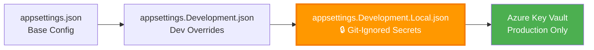
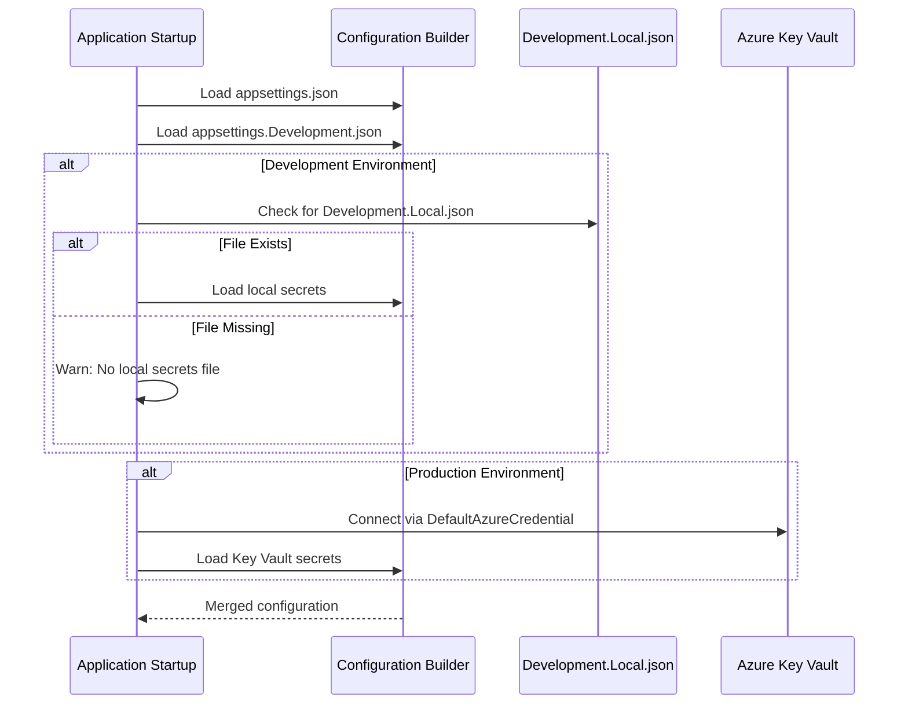

# Local Development Setup

## Table of Contents
- [Prerequisites](#prerequisites)
- [Quick Start](#quick-start)
- [Secrets Management](#secrets-management)
- [Configuration Files](#configuration-files)
- [Running the Applications](#running-the-applications)
- [Database Migrations](#database-migrations)
- [Troubleshooting](#troubleshooting)

## Prerequisites

### Required Tools

| Tool | Version | Purpose | Download |
|------|---------|---------|----------|
| .NET SDK | 8.0+ | Runtime framework | [Download](https://dotnet.microsoft.com/download) |
| Visual Studio Code | Latest | IDE | [Download](https://code.visualstudio.com/) |
| Git | Latest | Version control | [Download](https://git-scm.com/) |
| Azure CLI | Latest | Azure authentication | [Download](https://docs.microsoft.com/cli/azure/install-azure-cli) |
| SQL Server | 2019+ or Azure SQL | Database | [Download](https://www.microsoft.com/sql-server) |

### Recommended VS Code Extensions

```bash
# Install recommended extensions
code --install-extension ms-dotnettools.csharp
code --install-extension ms-azuretools.vscode-azurefunctions
code --install-extension ms-vscode.powershell
code --install-extension esbenp.prettier-vscode
```

### Azure Resources Required

You'll need access to these Azure services:

- ✅ **Azure SQL Database** - Data storage
- ✅ **Azure OpenAI** - GPT-4o-mini deployment
- ✅ **Azure AI Translator** - Multi-language support
- ✅ **Azure AD External ID (B2C)** - User authentication
- ⚙️ **Azure Key Vault** (Production only) - Secrets management

## Quick Start

### 1️⃣ Clone the Repository

```powershell
git clone https://github.com/KarimFam/aidcircleweb.git
cd aidcircleweb
```

### 2️⃣ Restore Dependencies

```powershell
dotnet restore H4H.sln
```

### 3️⃣ Configure Local Secrets

Copy the template files and populate with your Azure credentials:

```powershell
# API secrets
Copy-Item "H4H.Presentation.API\appsettings.Development.Local.json.template" `
          "H4H.Presentation.API\appsettings.Development.Local.json"

# Web app secrets
Copy-Item "H4H.Presentation.Web\H4H.Presentation.Web\appsettings.Development.Local.json.template" `
          "H4H.Presentation.Web\H4H.Presentation.Web\appsettings.Development.Local.json"
```

> [!IMPORTANT]
> The `.json` files (not `.template`) are git-ignored and will NEVER be committed to source control.

### 4️⃣ Update Configuration Values

Edit both `appsettings.Development.Local.json` files with your Azure credentials.

**API Configuration** (`H4H.Presentation.API\appsettings.Development.Local.json`):

```json
{
  "ConnectionStrings": {
    "H4HDB-DEV": "Server=YOUR_SERVER.database.windows.net;Database=YOUR_DB;User Id=YOUR_USER;Password=YOUR_PASSWORD;TrustServerCertificate=True;"
  },
  "AzureOpenAI": {
    "ApiKey": "YOUR_AZURE_OPENAI_API_KEY"
  },
  "AzureTranslator": {
    "Key": "YOUR_AZURE_TRANSLATOR_API_KEY"
  }
}
```

**Web Configuration** (`H4H.Presentation.Web\H4H.Presentation.Web\appsettings.Development.Local.json`):

```json
{
  "ConnectionStrings": {
    "H4HDB-DEV": "Server=YOUR_SERVER.database.windows.net;Database=YOUR_DB;User Id=YOUR_USER;Password=YOUR_PASSWORD;TrustServerCertificate=True;"
  },
  "AzureAd": {
    "ClientSecret": "YOUR_AZURE_AD_CLIENT_SECRET"
  },
  "AzureOpenAI": {
    "ApiKey": "YOUR_AZURE_OPENAI_API_KEY"
  },
  "AzureTranslator": {
    "Key": "YOUR_AZURE_TRANSLATOR_API_KEY"
  }
}
```

### 5️⃣ Apply Database Migrations

```powershell
dotnet ef database update --project H4H.Infrastructure --startup-project H4H.Presentation.API
```

### 6️⃣ Run the Applications

**Option A: Run both applications separately** (Recommended)

```powershell
# Terminal 1: Start API
dotnet run --project H4H.Presentation.API

# Terminal 2: Start Web App
dotnet run --project H4H.Presentation.Web/H4H.Presentation.Web
```

**Option B: Use VS Code tasks**

Press `Ctrl+Shift+P` → `Tasks: Run Task` → `Run Both Applications`

### 7️⃣ Access the Applications

- **Web App**: http://localhost:5011
- **API**: http://localhost:5135
- **Swagger**: http://localhost:5135/swagger

## Secrets Management

AidCircle uses a **multi-tier configuration loading** strategy for development:



### Configuration Priority (Lowest to Highest)

| Priority | File | Purpose | Committed to Git |
|----------|------|---------|------------------|
| 1 | `appsettings.json` | Base configuration | ✅ Yes |
| 2 | `appsettings.Development.json` | Dev environment defaults | ✅ Yes |
| 3 | `appsettings.Development.Local.json` | 🔒 **Your local secrets** | ❌ **NO** |
| 4 | Azure Key Vault | Production secrets | N/A |

### Secrets Flow Diagram



### Why Git-Ignored Local Files?

✅ **Advantages**:
- No secrets in source control
- Simple copy-paste setup for new developers
- No cloud dependencies for local dev
- Fast iteration without Azure CLI login

❌ **Alternative (User Secrets)**: More secure but requires `dotnet user-secrets` CLI knowledge

### Security Best Practices

> [!WARNING]
> **NEVER commit `appsettings.Development.Local.json` files!**

Check `.gitignore` contains:

```gitignore
# Local development secrets (NEVER COMMIT)
appsettings.Development.Local.json
**/appsettings.Development.Local.json
```

Verify your files are ignored:

```powershell
git status
# You should NOT see any .Development.Local.json files listed
```

## Configuration Files

### `appsettings.json` (Base Configuration)

Located in both `H4H.Presentation.API` and `H4H.Presentation.Web/H4H.Presentation.Web`.

**Purpose**: Non-sensitive default values committed to Git.

**Contains**:
- Application URLs
- Azure OpenAI endpoint (public URL, no secret)
- Azure Translator endpoint (public URL, no secret)
- Azure AD B2C tenant information (public)
- Logging levels

**Example**:

```json
{
  "Logging": {
    "LogLevel": {
      "Default": "Information",
      "Microsoft.AspNetCore": "Warning"
    }
  },
  "AzureOpenAI": {
    "Endpoint": "https://your-resource.openai.azure.com/",
    "DeploymentName": "gpt-4o-mini"
  },
  "AzureTranslator": {
    "Endpoint": "https://api.cognitive.microsofttranslator.com",
    "Region": "eastus"
  }
}
```

### `appsettings.Development.json` (Dev Defaults)

**Purpose**: Development-specific settings shared across team.

**Contains**:
- Detailed logging configuration
- Development-friendly connection timeout values
- CORS policies for local testing

**Example**:

```json
{
  "Logging": {
    "LogLevel": {
      "Default": "Debug",
      "Microsoft.EntityFrameworkCore.Database.Command": "Information"
    }
  }
}
```

### `appsettings.Development.Local.json` 🔒 (Your Secrets)

**Purpose**: Your personal Azure credentials for local development.

**Contains**:
- Database connection string with password
- Azure OpenAI API key
- Azure Translator API key
- Azure AD B2C client secret

> [!TIP]
> Copy from the `.template` file to get started quickly!

## Running the Applications

### Development Mode (Recommended)

This loads local secrets from `appsettings.Development.Local.json`:

```powershell
# Start API (Terminal 1)
dotnet run --project H4H.Presentation.API

# Start Web (Terminal 2)
dotnet run --project H4H.Presentation.Web/H4H.Presentation.Web
```

**Verify secrets are loaded**:

Look for this log message on startup:

```
info: Program[0]
      ✅ Loaded local secrets from appsettings.Development.Local.json
```

### Production Mode (Key Vault)

This connects to Azure Key Vault using `DefaultAzureCredential`:

```powershell
# Login to Azure first
az login

# Run in production mode
dotnet run --project H4H.Presentation.API --environment Production
```

**Verify Key Vault connection**:

Look for this log message:

```
info: Program[0]
      ✅ Connected to Azure Key Vault: https://your-vault.vault.azure.net/
```

### Watch Mode (Auto-Reload on Code Changes)

For rapid development:

```powershell
dotnet watch --project H4H.Presentation.Web/H4H.Presentation.Web
```

Changes to `.cs` or `.razor` files trigger automatic rebuild and browser refresh.

## Database Migrations

### View Applied Migrations

```powershell
dotnet ef migrations list --project H4H.Infrastructure --startup-project H4H.Presentation.API
```

### Create a New Migration

```powershell
dotnet ef migrations add YourMigrationName `
  --project H4H.Infrastructure `
  --startup-project H4H.Presentation.API
```

### Apply Migrations to Database

```powershell
# Apply all pending migrations
dotnet ef database update --project H4H.Infrastructure --startup-project H4H.Presentation.API

# Apply to specific migration
dotnet ef database update MigrationName --project H4H.Infrastructure --startup-project H4H.Presentation.API
```

### Rollback Migration

```powershell
# Rollback to previous migration
dotnet ef database update PreviousMigrationName --project H4H.Infrastructure --startup-project H4H.Presentation.API

# Remove last migration (if not applied)
dotnet ef migrations remove --project H4H.Infrastructure --startup-project H4H.Presentation.API
```

### Generate SQL Script (Without Applying)

```powershell
dotnet ef migrations script --project H4H.Infrastructure --startup-project H4H.Presentation.API --output migration.sql
```

## Troubleshooting

### Common Issues & Solutions

| Issue | Symptoms | Solution |
|-------|----------|----------|
| **Missing local secrets file** | `KeyNotFoundException: Configuration key not found` | Copy `.template` file to `.json` and populate values |
| **Incorrect connection string** | `SqlException: Login failed for user` | Verify SQL Server credentials in local config |
| **Azure AD 401 errors** | `Redirect loop` or `Invalid client` | Check `ClientSecret` in local config matches Azure portal |
| **Azure OpenAI 404** | `DeploymentNotFound` | Verify `DeploymentName` matches your Azure OpenAI model deployment |
| **Translation 401** | `Service request failed: 401 Unauthorized` | Check `AzureTranslator:Key` is correct |
| **Build errors after git pull** | `Could not copy DLL` | Stop all running `dotnet` processes: `taskkill /F /IM dotnet.exe` |
| **Migration failures** | `Table already exists` | Check database state: `dotnet ef database drop` then re-apply migrations |

### Detailed Troubleshooting

#### Problem: "Local secrets file not found"

**Error Message**:
```
warn: Program[0]
      ⚠️ Local secrets file not found at: appsettings.Development.Local.json
```

**Solution**:

```powershell
# Verify template exists
Test-Path "H4H.Presentation.API\appsettings.Development.Local.json.template"

# Copy template
Copy-Item "H4H.Presentation.API\appsettings.Development.Local.json.template" `
          "H4H.Presentation.API\appsettings.Development.Local.json"

# Edit with your credentials
code "H4H.Presentation.API\appsettings.Development.Local.json"
```

#### Problem: "Azure AD authentication redirect loop"

**Symptoms**: Browser keeps redirecting to login page infinitely.

**Root Cause**: `AzureAdB2C:Instance` must end with `/`

**Solution**:

Check `appsettings.json`:

```json
{
  "AzureAdB2C": {
    "Instance": "https://aidcirclenet.b2clogin.com/",  // ✅ Note the trailing slash
    "ClientId": "36bf28fa-d15c-4762-8c32-8e46c3aa9051",
    "Domain": "aidcirclenet.onmicrosoft.com",
    "SignUpSignInPolicyId": "B2C_1_susi"
  }
}
```

#### Problem: "Database migration fails with 'already exists'"

**Error Message**:
```
There is already an object named 'Users' in the database.
```

**Solution**:

```powershell
# Option 1: Drop and recreate (development only!)
dotnet ef database drop --project H4H.Infrastructure --startup-project H4H.Presentation.API
dotnet ef database update --project H4H.Infrastructure --startup-project H4H.Presentation.API

# Option 2: Manually delete conflicting tables in SQL Server Management Studio
# Then re-run migrations
```

#### Problem: "Chat returns TotalTokens error"

**Error Message**:
```
'OpenAI.Chat.ChatTokenUsage' does not contain a definition for 'TotalTokens'
```

**Root Cause**: Semantic Kernel SDK version mismatch.

**Solution**: Already fixed in latest code. Pull latest changes:

```powershell
git pull origin main
dotnet restore
dotnet build
```

### Debugging Tips

**Enable detailed EF Core logging**:

Add to `appsettings.Development.json`:

```json
{
  "Logging": {
    "LogLevel": {
      "Microsoft.EntityFrameworkCore.Database.Command": "Information",
      "Microsoft.EntityFrameworkCore.Infrastructure": "Debug"
    }
  }
}
```

**Test Azure OpenAI connectivity**:

```powershell
curl https://your-resource.openai.azure.com/openai/deployments/gpt-4o-mini/chat/completions?api-version=2024-02-15-preview `
  -H "api-key: YOUR_KEY" `
  -H "Content-Type: application/json" `
  -d '{"messages":[{"role":"user","content":"Hello"}]}'
```

**Verify SQL Server connection**:

```powershell
# Using sqlcmd (install from https://aka.ms/sqlcmd)
sqlcmd -S your-server.database.windows.net -d your-database -U your-user -P your-password -Q "SELECT @@VERSION"
```

## Alternative Setup: User Secrets

If you prefer .NET User Secrets over local files:

### Initialize User Secrets

```powershell
# API project
dotnet user-secrets init --project H4H.Presentation.API

# Web project
dotnet user-secrets init --project H4H.Presentation.Web/H4H.Presentation.Web
```

### Set Secrets

```powershell
# Example: Set connection string
dotnet user-secrets set "ConnectionStrings:H4HDB-DEV" "Server=...;Database=...;User Id=...;Password=...;" `
  --project H4H.Presentation.API
```

### Modify Program.cs

Comment out the local file loading code and uncomment User Secrets:

```csharp
// Option 1: Local file (current implementation)
// var localSettingsPath = Path.Combine(builder.Environment.ContentRootPath, "appsettings.Development.Local.json");
// if (File.Exists(localSettingsPath)) { ... }

// Option 2: User Secrets (alternative)
if (builder.Environment.IsDevelopment())
{
    builder.Configuration.AddUserSecrets<Program>();
}
```

## Next Steps

- ✅ **Environment configured** → Try the [AI Chat Deep Dive](ai-chat.md)
- 🚀 **Ready to deploy?** → See [Deployment Guide](deployment.md)
- 🏗️ **Want to understand the architecture?** → Read [Architecture Overview](architecture-overview.md)
